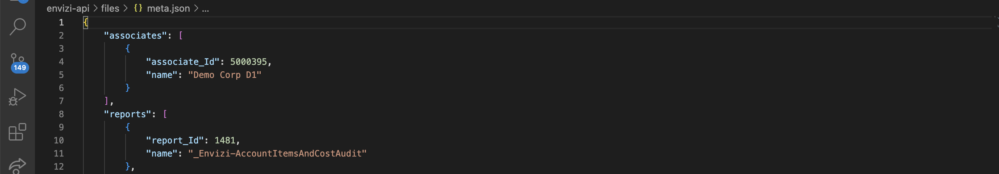
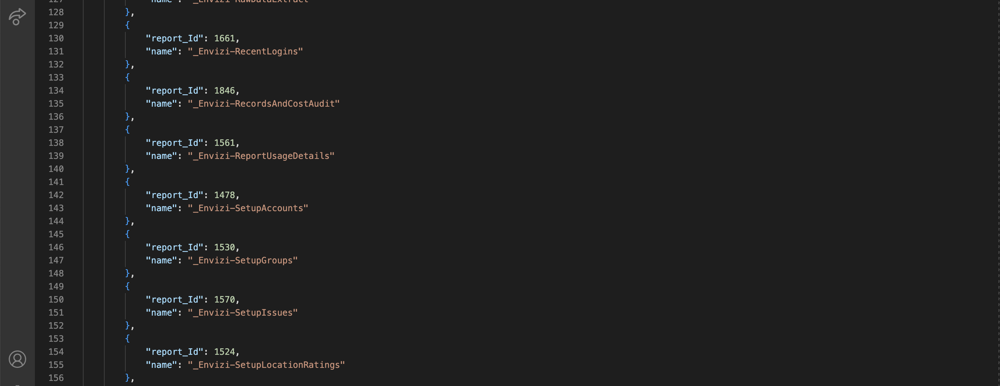

# Exposing Envizi data for external systems by leveraging API 

This article explains using Envizi API to explort the data

#### Authors
 [Jeya Gandhi Rajan M](https://community.ibm.com/community/user/envirintel/people/jeya-gandhi-rajan-m1), [Indira Kalagara](https://community.ibm.com/community/user/envirintel/people/indira-kumari-kalagara1)

Envizi provides the following 3 types of APIs to the user.
1. Retrieve Report Names
2. Retrieve Report Parameters
3. Retrieve Report Data


## API URL

The root URL of the API would be the following.

- For Australia, New Zealand and ASEAN users - https://auapi.envizi.com/api
- For US and Canada users - https://usapi.envizi.com/api
- For UK and South African users - https://ukapi.envizi.com/api

A valid Envizi user name and password must be supplied for authentication. 

## API Authentication

The Envizi API uses Basic Authentication method. You can use the existing Envizi login and password for the API Authentication. 

## 1. Retrieve Report Names

The API `meta` option allows the user get the list of API reports that are available to this login. 

The API report names retrieved here to be used with all other meta and data API calls.


#### Sample Code

Here is the sample code to pull the report names.

```
export API_USER=<<USER>>
export API_PASSWORD=<<PASSWORD>>
export API_REGION=<<REGION>>

export API_USER_PASSWORD="$API_USER:$API_PASSWORD"
export API_URL=https://$API_REGION.envizi.com/api/meta

curl -u $API_USER_PASSWORD "$API_URL"

```

- `<<USER>>` Envizi login id
- `<<PASSWORD>>` Envizi password
- `<<REGION>>` The value would be `uk` , `au` or `us` based on the user region.

#### Sample Result

The sample result of the above API would be like this [file](./files/meta.json).





#### 2. Retrieve Report Parameters

Similar to running report in Envizi's main user interface, with Envizi API you are able to specify report parameters, such as report ending period, location name etc. However there is no user interface in API to allow you to make such selections - the solution to this is to use the meta/reports/<API report name> API call.

Unlike running reports from Envizi's main interface, in the API, for Envizi entities such as Location and Group, their exact Envizi Id must be specified in the API data call. The meta/reports/<API report name> call allows you to retrieve list of available parameter names and their ids in the specified report. These parameter names and ids can then be used in the actual API data calls later. 

The /meta/reports/<API report name> allows you to see the following, provided they are applicable to the report:

### Retrieve Report Data
Once you have retrieved API report names through meta option, you can use the data option to retrieve the data. The naming convention for all Envizi supplied API reports is that they all start with '_Envizi', followed by a dash '-' and then the API report name, e.g., _Envizi-MonthlyDataSummary. 

## Reference

Envizi API Technical Documentation
https://knowledgebase.envizi.com/home/envizi-api-technical-documentation


#sustainability #envizi #API